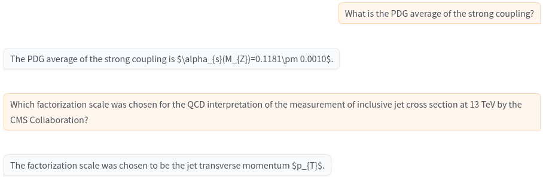

# ChatQCD: Let Large Language Models Explore QCD
[Antonin Sulc (HZB)](https://sulcantonin.github.io/), [Patrick Connor (UHH)](https://www.desy.de/~connorpa/)

## Applications
- *Text generation* - Q&A, similar to the any other LLMs, just finetuned on QCD data)
- *Validation* - Calculate logits of inputs, if there is a word that does not fit into the context, it is going to be removed
- *Prediction* - Predict next paragraph based on the given paragraph based on our knowledge of QCD (the other LLMs are generic)
- *Data mining* - Most machine learning models are bottlenecks on the input data and training tires to find hidden links between data that require a small representaion, small LLMs are not different. The trained model can be used to reverse engeer the links that we don't see. 

[paper](ChatQCD_POS.pdf)|[poster](https://indico.cern.ch/event/1291157/contributions/5902233/attachments/2896991/5080392/CHATQCD_ICHEP24.pdf)|[🤗model](https://huggingface.co/sulcan/CHATQCD)|[🤗 data](https://huggingface.co/datasets/sulcan/ChatQCD/)

Quantum chromodynamics (QCD) has yielded a vast literature spanning distinct phenomena. We construct a corpus of papers and build a generative model. This model holds promise for accelerating the capability of scientists to consolidate our knowledge of QCD by the ability to generate and validate scientific works in the landscape of works related to QCD and similar problems in HEP. Furthermore, we discuss challenges and future directions of using large language models to integrate our scientific knowledge about QCD through the automated generation of explanatory scientific texts.

## Code & Examples
[train.ipynb](train.ipynb)|[test.ipynb](test.ipynb)
